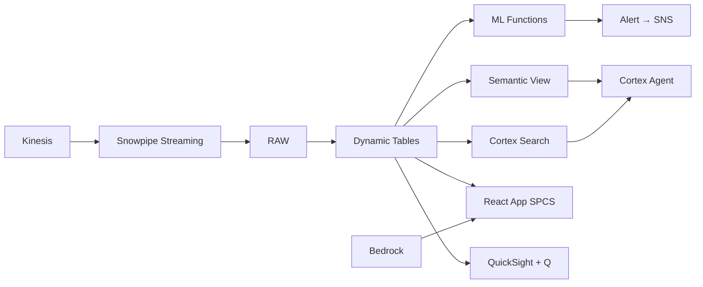

# Dealer Network & Sales Intelligence

Sales intelligence across 450 Thai dealerships — Personalize drives next-best-action recommendations, Cortex Complete generates personalized outreach, and SES delivers through Notification Integration.

## Architecture

Thailand's largest auto brand operates 450 dealerships nationwide, but fragmented CRM data means ฿3.2B in quarterly sales gap goes unaddressed. AI-powered next-best-action recommendations, personalized outreach, and demand-driven inventory allocation can close the gap — all from unified Snowflake analytics.



## Snowflake Capabilities

| Capability | Implementation |
|-----------|---------------|
| Dynamic Tables | DEALER_PERFORMANCE / REGIONAL_SALES_TRENDS / CUSTOMER_SEGMENTS / INVENTORY_DEMAND_MATCH |
| ML Functions | ML.FORECAST + ML.ANOMALY_DETECTION |
| Cortex AI | COMPLETE, AI_CLASSIFY, AI_EXTRACT |
| Cortex Search | 200 documents indexed |
| Cortex Agent | DEALER_INTELLIGENCE_AGENT |
| Semantic View | DEALER_SALES_ANALYTICS |
| React App (SPCS) | 5 tabs + DemoGuide |


## AWS Services

| Service | Role in Demo |
|---------|-------------|
| Amazon Personalize | Generate next-best-action recommendations for dealers and customers |
| Amazon SES | Send personalized dealer and customer communications |
| Amazon Bedrock (Claude) | Generate personalized outreach content for dealer communications |
| Amazon Kinesis | Stream real-time sales events from dealer POS systems |
| Amazon SNS | Push notifications for urgent sales alerts |
| Amazon QuickSight + Q | Regional sales performance dashboard with NL queries |


## Personas

| Persona | Role | Key Questions |
|---------|------|---------------|
| **Kittisak Charoenphol** | VP Sales & Distribution | "Which regions are below sales target?" "What's our dealer network health score?" |
| **Patchara Wongsawat** | Regional Sales Manager | "What's the NBA recommendation for dealer D-0234?" "Show me conversion rate trends for Bangkok dealers." |


## Data

| Table | Rows | Description |
|-------|------|-------------|
| DEALERS | 450 | Dealer locations across Thailand by region |
| SALES_TRANSACTIONS | 85,000 | 12 months of vehicle sales with customer and model details |
| CUSTOMER_PROFILES | 120,000 | Customer demographics, purchase history, service records |
| INVENTORY | 15,000 | Current dealer inventory by model, color, spec |
| LEADS | 35,000 | Sales leads with source, stage, and conversion status |
| NBA_ACTIONS | 2,000 | Next-best-action recommendations generated by AI |
| MARKETING_CAMPAIGNS | 200 | Campaign performance data by channel and region |
| THAI_AUTO_MARKET | 12 | Thailand automotive market size and competitive landscape |


## Build Instructions

### Prerequisites
- Snowflake account with ACCOUNTADMIN access
- Cortex AI enabled (ML Functions, Search, Agent)
- Warehouse: DEALER_WH (Medium)
- AWS CLI with access (us-west-2)

### Deployment

```bash
snowsql -f snowflake/00_setup.sql
snowsql -f snowflake/01_marketplace_install.sql
snowsql -f snowflake/02_raw_tables.sql
snowsql -f snowflake/03_staging.sql
snowsql -f snowflake/04_dynamic_tables.sql
snowsql -f snowflake/05_search.sql
snowsql -f snowflake/06_ml_models.sql
snowsql -f snowflake/07_semantic_view.sql
snowsql -f snowflake/08_agent.sql
```

### React App (SPCS)
```bash
cd app && npm ci && npm run build
docker build -t aws-thailand-automotive-dealer-sales-app .
docker push bdiqc8sm-default.registry.snowflakecomputing.com/dealer_sales_intel/app/aws_thailand_automotive_dealer_sales/app:latest
```

### Demo Mode
Open the app URL with `?demo=true` for presenter view.

## Build Modes

### Snowflake Only
Run scripts 00-08 (skip AWS-specific integration). Uses:
- **Cortex Complete (NBA generation)** instead of Amazon Personalize
- **Notification Integration (email)** instead of Amazon SES
- **Cortex Complete** instead of Amazon Bedrock (Claude)
- **Snowpipe Streaming SDK** instead of Amazon Kinesis
- **Alerts + Notification Integration** instead of Amazon SNS
- **Snowflake Intelligence (Cortex Analyst)** instead of Amazon QuickSight + Q

### Full AWS + Snowflake
Run all scripts including AWS integration. Deploy QuickSight dashboard from `quicksight/`.

## Business Impact

Industry research and Snowflake customer outcomes:
- **Thailand's domestic auto market: 775,780 vehicles sold in 2023 through 2,800+ dealer outlets** — [FTI Thailand](https://www.fti.or.th/eng/)
- **AI-powered NBA increases dealer conversion rates by 15-30% in automotive retail** — [McKinsey Automotive](https://www.mckinsey.com/industries/automotive-and-assembly/our-insights)
- **Demand-driven inventory allocation reduces days-on-lot by 20-35%, improving working capital** — [BCG Automotive](https://www.bcg.com/industries/automotive)
- **Personalized dealer communications increase engagement 3-5x over generic outreach** — [Salesforce State of Marketing](https://www.salesforce.com/resources/research-reports/state-of-marketing/)
- **BMW Group** (Snowflake customer): saved 25% on large data workloads and launched 60 operational use cases in 18 months on Snowflake -- [snowflake.com/customers/bmw-group](https://www.snowflake.com/en/customers/all-customers/case-study/bmw-group/)

## Key Demo Numbers

- **฿3.2B** quarterly sales gap to close (US$91M)
- **47 dealers** flagged for intervention (conversion rate declining)
- **450 dealers** receiving personalized NBA recommendations weekly
- **15% EV surge** forecast for Chiang Mai next quarter (ML.FORECAST)
- **85,000 sales** transactions analyzed for pattern detection
- **2,000 NBAs** generated by Cortex Complete this quarter


## License

Apache 2.0 — See [LICENSE](LICENSE) for details.

This is a personal demo project and is not an official Snowflake offering. It comes with no support or warranty.